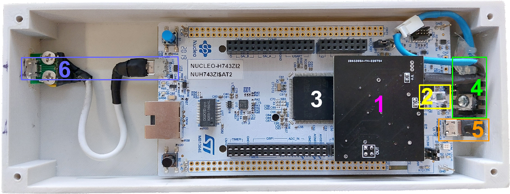

# Violin-pd 

This repository contains the open-source version of part of the VIOLIN (Visible Light Communications in Communications, Marketing, Transport, Logistics, Cultural and Tourist Industries) project.
It contains demo code for a low-cost Visible Light Communication (VLC) system using a photodiode-based receiver.

The demo system comprises of a VLC transmiter, a VLC receiver and two Linux PCs, one for providing the transmission data ("server") and another for receiving it.

## Credits

The VIOLIN project has been co-financed by the European Union and Greek national funds through the Operational Program Competitiveness, Entrepreneurship and Innovation, under the call RESEARCH-CREATE-INNOVATE (project code: T1EDK-02419).

The work presented in this repository has been performed by the following members of the [VLSI Systems and Computer Architecture Laboratory (VCAS)](https://vcas.cs.uoi.gr/), in the [Department of Computer Science and Engineering](https://www.cse.uoi.gr/), [University of Ioannina](https://uoi.gr/), Greece:
Yiorgos Tsiatouhas, Aristides Efthymiou, Simon-Ilias Poulis, Georgios Papatheodorou, Yiorgos Sfikas, Christoforos Papaioanou, Marina Plisiti, John Liaperdos.

## Transmiter 

The block diagram of the transmiter, which contains a Nucleo STM32 H743ZI2, a power LED and the LED driver is shown below. In addition a [Power over Ethernet (PoE) powered device (PD) board](https://www.analog.com/en/resources/evaluation-hardware-and-software/evaluation-boards-kits/dc2583a.html), is used to receive the data and power the reset of the system. The Nucleo board and the Driver require buck converters which provide their power supply. Photographs of the prototype are also shown.

two Nucleo STM32 H743ZI2 boards, one acting as a VLC transmitter

The STM32 board firmware code and a brief description can be found in the ['xmit/xmit_firmware'](./xmit/xmit_firmware/README.md) directory.
The driver circuit is described in `xmit/xmit_hardware`.

## Receiver

The receiver prototype is shown below.

It contains a Nucleo STM32 H743ZI2 (3), and an analog front end (1), with a photodiode (2), a LDO to provide a clean power supply to the analog front end (4), a USB connector (6) to connect to the receiving host (PC or an Android mobile phone), and another USB connector (5) to supply power to the nucleo board and provide a debug port.

The analog front end (AFE) diagram is shown below. For a detailed description see 
S-I. Poulis, G. Papatheodorou, C. Papaioannou, Y. Sfikas, M. E. Plissiti, A. Efthymiou, J. Liaperdos and Y. Tsiatouhas, “Effective Current Pre-Amplifiers for Visible Light Communication (VLC) Receivers,” MDPI, Technologies, vol. 10,36, 2022

The STM32 board firmware code and a brief description can be found in the ['recv/recv_firmware'](./recv/recv_firmware/README.md) directory.
The AFE board is described in `recv/recv_hardware`.

## Host (PC) applications

The "server PC" and the transmiter nucleo board are communicating via ethernet, while the receiving PC and the receiver nucleo board are connected by a USB cable.
In the provided demo code, the "server PC" continuously sends a file to the VLC transmiter board, while the receiver application enables the VLC receiver board and gradually assembles the file from the VLC frames captured by the nucleo board which are sent over a USB cable.

The applications source code and a brief description can be found in 'hostApps' directory.

